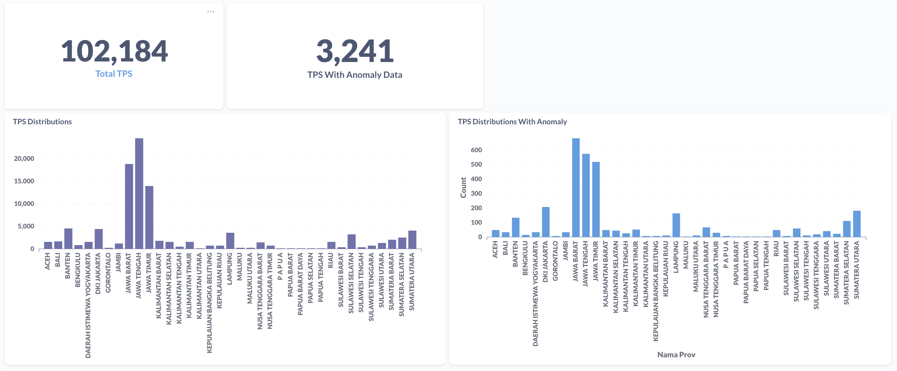
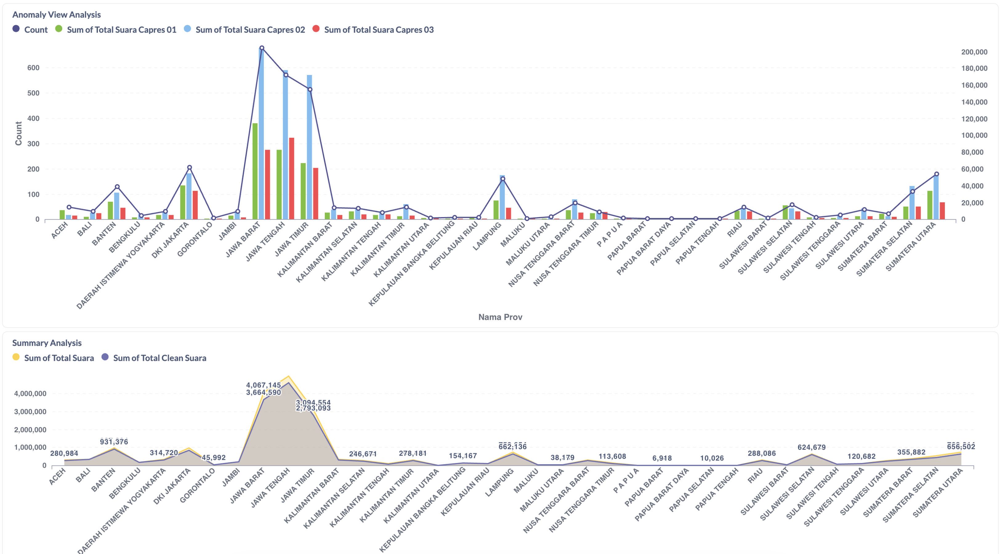
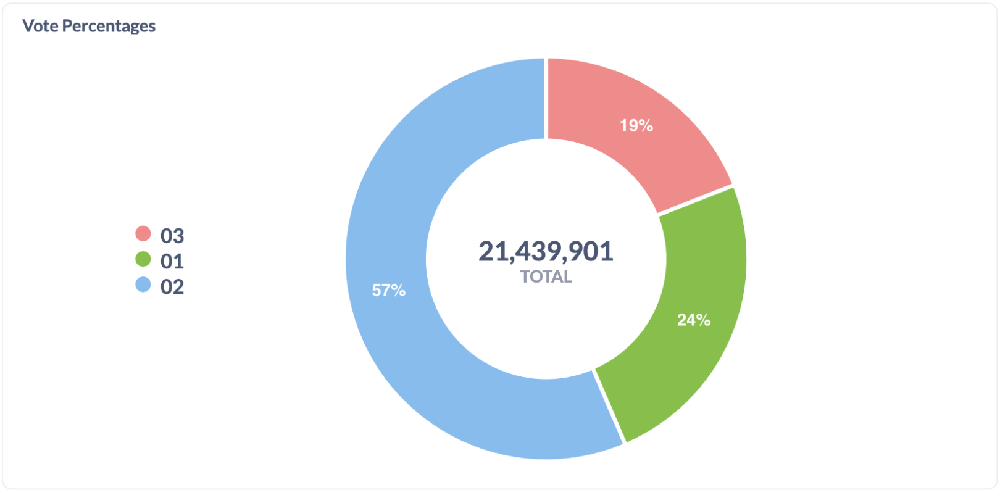
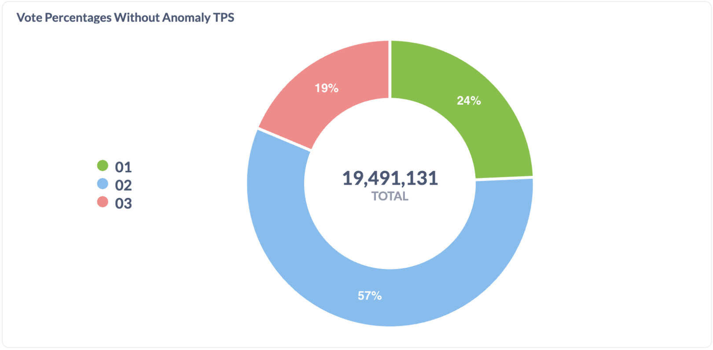

# 🚀 #JagaPemilu2024: Analisis Data Hasil Suara [Open Source] 🚀

## Latar Belakang Proyek
Inisiatif `#JagaPemilu2024` bertujuan untuk menganalisis data pemilu dengan menyaring data tidak valid untuk menyajikan gambaran yang lebih jelas tentang hasil pemilu. Dengan membuat proyek ini open source, kami mendorong individu untuk menerapkan dan menganalisis data di perangkat mereka sendiri, mendukung transparansi dan pengawasan kolektif dalam proses demokrasi.

## Alat yang Digunakan
- **Benthos** (https://www.benthos.dev/): Untuk pemrosesan stream dan manipulasi data.
- **ClickHouse** (https://clickhouse.com/): Sebagai database analitik untuk menyimpan dan menanyakan data pemilu dengan efisien.
- **Metabase** (https://www.metabase.com/): Untuk visualisasi dan penyaringan data.

## Metodologi
Pendekatan kami melibatkan crawling data KPU terbaru, menyimpannya dalam database analitik, lalu visualisasi dan penyaringan data untuk mengidentifikasi dan memperbaiki ketidaksesuaian. Data TPS tidak valid diidentifikasi berdasarkan kriteria berikut:
- Suara sah = 0 & total suara > 300, atau
- Suara sah > 0 tapi < total suara semua pasangan calon.

## Hasil (Per 15 Feb 2024, 09:00 WIB)
- **Total TPS Dianalisis**: 337,602 (41.01%)
- **TPS dengan Data Tidak Valid**: 3,241



- **Distribusi TPS Tidak Valid Antara Calon**:
  - Ditemukan menguntukan semua calon 
  - Paling banyak terjadi pada pasangan calon 02.


[Download Data TPS Tidak Valid](https://docs.google.com/spreadsheets/d/1GdXAggXsYzqaiLT7XrsUe_7pOtUF1ZQGJRmTJlONB8E/edit?usp=sharing)

- **Distribusi Suara Keseluruhan**:
    - Pasangan 01: 5,244,869 suara (24.46%)
    - Pasangan 02: 12,138,339 suara (56.62%)
    - Pasangan 03: 4,056,693 suara (18.92%)


- **Setelah Koreksi Data Tidak Valid**:
    - Pasangan 01: 4,720,556 suara (24.22%)
    - Pasangan 02: 11,153,402 suara (57.22%)
    - Pasangan 03: 3,617,163 suara (18.56%)
      

## Pernyataan Tanggung Jawab

Kami, tim pengembang proyek #JagaPemilu2024, menyediakan alat ini dengan tujuan baik untuk mendukung transparansi dan keadilan dalam pemilihan umum. Namun, kami ingin menegaskan bahwa:

- Proses crawling atau pengambilan data dari situs KPU dilakukan dengan asumsi bahwa pengguna telah memahami dan menerima segala risiko yang terkait, termasuk potensi beban tambahan pada server KPU.
- Kami mendorong penggunaan proyek ini secara bertanggung jawab dan dengan mempertimbangkan etika pengambilan data publik. Kami merekomendasikan pengguna untuk membatasi frekuensi permintaan mereka untuk menghindari dampak negatif pada kinerja situs KPU.
- Segala macam dampak yang timbul dari penggunaan proyek ini, termasuk namun tidak terbatas pada beban berlebih pada infrastruktur KPU atau konsekuensi hukum dari pengambilan data, adalah di luar tanggung jawab tim pengembang.
- Kami tidak bertanggung jawab atas penggunaan alat ini dalam cara yang melanggar kebijakan, hukum, atau regulasi yang berlaku terkait dengan data dan akses internet.

Kami berharap proyek ini digunakan sebagai sarana untuk meningkatkan kesadaran dan partisipasi dalam proses demokrasi, dengan menghormati batasan dan ketentuan yang ditetapkan oleh sumber data.

Dengan menggunakan proyek ini, Anda, sebagai pengguna, menyetujui bahwa Anda memahami dan menerima kondisi yang telah disebutkan di atas.

## Mencoba menjalankan sendiri

Langkah 1: Persiapan
- Pastikan anda memiliki Docker yang terinstall. 
- Pastikan anda memiliki benthos yang terinstall. `brew install benthos`


Langkah 2: Menjalankan ClickHouse Dan Metabase
```shell
make run-analytics
```

Langkah 3: Buka browser dan access metabase
```shell
http://localhost:3000/
```
user: pemilu@gmail.com
password: pemilu2024

Langkah 4: Jalankan crawler TPS data
```shell
 benthos -c crawler_suara.yaml
```

untuk berhenti:
Langkah 4: Jalankan crawler TPS data
```shell
 make stop-analytics
```

## Bergabung dan Kontribusi
Kami mengundang siapa saja untuk bergabung dalam inisiatif ini dan bersama-sama mengawal proses pemilu di Indonesia. Mari bergabung dalam upaya kami untuk mendukung demokrasi Indonesia yang lebih baik!
